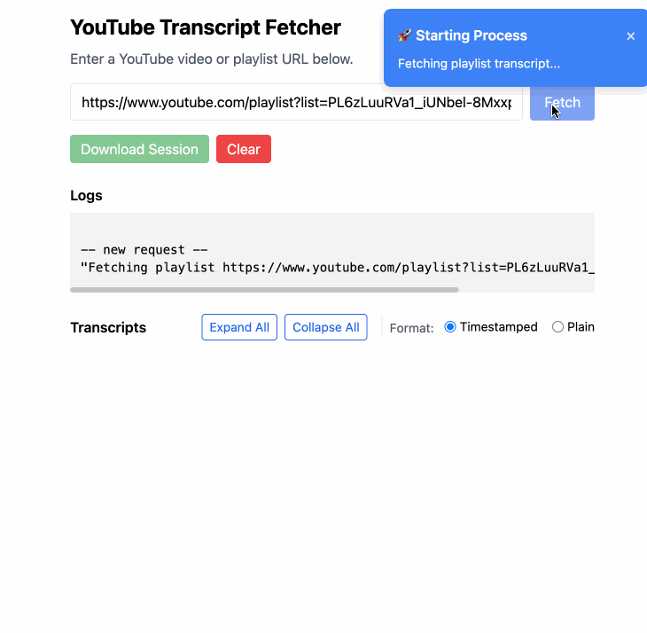

# YouTube Playlist Transcriber 🎥📝

**Skip the watching, get straight to the insights.** Extract complete YouTube transcripts to feed into AI for instant summaries and analysis.



## 💡 Perfect For AI-Powered Content Analysis

**Don't have time to watch hours of videos?** Get full transcripts instantly and let AI do the heavy lifting:

- ✨ **Feed transcripts to ChatGPT/Claude** for instant summaries
- 📊 **Process entire playlists** - analyze 100+ videos in minutes, not hours
- 🎯 **Extract key insights** from long-form content without watching

## ✨ Key Features

- **📋 Full Playlist Support**: Process entire YouTube playlists (up to 100 videos) automatically
- **🎯 Single Video Mode**: Quick transcript extraction for individual videos
- **🔒 100% Private**: Runs locally - your data never leaves your computer
- **📄 Complete Transcripts**: Full text with timestamps, ready for AI processing
- **⚡ Real-time Progress**: Watch processing with live updates

## 🚀 Quick Start

```bash
npm install
npm start
```

Visit `http://localhost:3000` and paste either:
- **Single video URL**: `https://youtube.com/watch?v=...`
- **Playlist URL**: `https://youtube.com/playlist?list=...`

Copy the transcript and paste into your favorite AI tool for instant summaries!

## 🎯 Common Use Cases

- **📝 Meeting/Conference Analysis**: Extract key points from recorded sessions
- **🎓 Educational Content**: Convert lectures into study notes  
- **📊 Competitive Research**: Analyze competitor content at scale
- **📰 News Tracking**: Process multiple news videos for trend analysis

## 🔧 API Endpoints

**Playlist Processing:**
- `GET /api/playlist?playlistUrl=...` - Process entire playlist
- `GET /api/playlist/stream?playlistUrl=...` - Streaming with progress

**Single Video:**
- `GET /api/transcript?videoUrl=...` - Single video transcript  
- `GET /api/transcript/stream?videoUrl=...` - Streaming single video

---

*Save hours of watching time. Get transcripts, feed them to AI, extract insights instantly.*